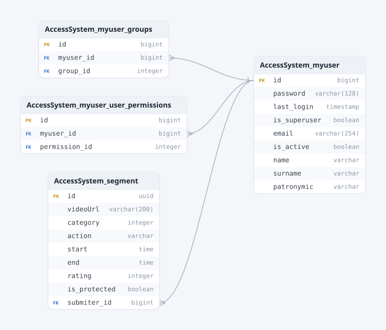
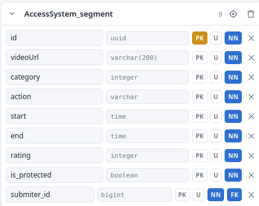
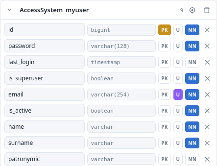
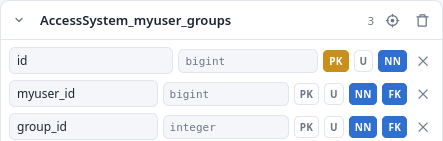
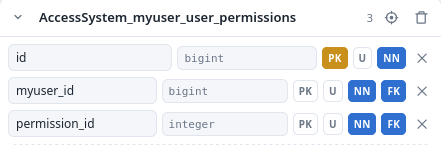

# StackBridge-Test-Assignment
[Техническое задание](https://stackbridge-it.ru/test-tasks/PYTHON) на позицию [Junior Python Developer](https://stackbridge-it.ru/forms/tz_junior/?specialty=PYTHON) в StackBridge.

## Доменная область
В качестве минимальных вымышленных бизнес-объектов я решил взять *сегменты* видеозаписей. Речь идёт о довольно известном браузерном расширении как SponsorBlock и о его аналоге для ВК Видео VK AD SKIP. Принцип работы этих расширений состоит в том, что пользователи отмечают определённый промежуток видео, который, по их мнению, подпадает под одну из нескольких категорий: рекламная вставка, самореклама своего канала, напоминание о подписке и комментарии и т.&nbsp;д. Мне было интересно реализовать именно это взаимодействие между пользователями и сегментами, поскольку я сам активно отмечаю сегменты в обоих сервисах и участвую в комьюнити.

## Схема базы данных
И SponsorBlock, и VK AD SKIP не требуют регистрации по почте и паролю, идентификация в них происходит (насколько я знаю) исключительно по IP-адресу отправителя сегмента. Однако дальше будут использоваться именно электронный адрес и пароль.

Задание было реализовано на Django Rest Framework и PostgreSQL, также был использован Docker.

Данные четыре таблицы (отношения) были сгенерированы Django по команде `django python manage.py sqlmigrate AccessSystem 0001_initial`. Миграция, в свою очередь, была сформирована на основе мною написанных `AccessSystem/admin.py` и `AccessSystem/models.py`.



### Отношение «Сегмент»

```py
class Segment(models.Model):
    id = models.UUIDField('идентификатор', primary_key=True, default=uuid.uuid4, editable=False)
    videoUrl = models.URLField('URL видео, которому принадлежит сегмент')

    class Categories(models.IntegerChoices):
        __empty__ = _('Выберите категорию сегмента')
        SPONSOR = 1, _('Реклама или спонсор видео')
        SELF = 2, _('Самореклама (услуг или своих интернет-ресурсов)')
        ACTION = 3, _('Напоминание о взаимодействии (лайк, подписка, комментарий)')
        RECAP = 4, _('Пересказ предыдущих видео или рассказ о том, что будет в следующих')
    category = models.IntegerField('категория сегмента', choices=Categories)

    class Actions(models.TextChoices):
        SKIP = 'Пропустить'
        MUTE = 'Заглушить'
    action = models.CharField('действия с сегментом', choices=Actions, default=Actions.SKIP)

    start = models.TimeField('начало сегмента')
    end = models.TimeField('конец сегмента')
    submiter = models.ForeignKey(
        settings.AUTH_USER_MODEL,
        models.DO_NOTHING,
        verbose_name='идентификатор загрузившего пользователя'
    )
    rating = models.IntegerField('вес сегмента', default=0)
    is_protected = models.BooleanField('сегмент защищён модератором или администратором', default=False)

    class Meta:
        permissions = (
            # ('change_segment', 'Изменение отдельно начала и конца сегмента. Доступно только администраторам.'),
            # ('delete_segment', 'Удаление сегмента. Доступно только администраторам или модераторам.'),
            ('protect_segment', 'Защита сегмента от последующих изменений со стороны рядовых пользователей. Доступно только администраторам или модераторам.'),
            ('change_category', 'Изменение категории сегмента.'),
            ('change_action', 'Изменение действия над категорией (заглушение или пропуск).'),
            ('vote', 'Проголосовать за или против сегмента, таким образом поддержав его от скрытия или наоборот.')
        )
```

### Отношение «Пользователь»

```py
class MyUser(AbstractBaseUser, PermissionsMixin):
    email = models.EmailField('почта', unique=True)
    USERNAME_FIELD = 'email'
    EMAIL_FIELD = 'email'
    is_active = models.BooleanField(default=True)

    name = models.CharField('имя')
    surname = models.CharField('фамилия')
    patronymic = models.CharField('отчество', null=True)
    REQUIRED_FIELDS = ['name', 'surname']

    objects = MyUserManager()

    @property
    def is_staff(self):
        return self.is_superuser
```

### Отношение «Пользователи—Группы доступа»


Управление группами пользователей и групповыми ограничениями было частично возложено на DRF. В конце файла `AccessSystem/admin.py` я закомментировал строки создания трёх групп пользователей, обладающих своими разрешениями: **администраторы** (`id = 1`), **модераторы** (`id = 2`) и **обычные пользователи** (`id = 3`).

Администраторы, в отличие от модераторов, могут не только просматривать, добавлять, изменять и удалять сегменты и других пользователей, но также добавлять, изменять и удалять группы пользователей, сессии аутентификации, назначать индивидуальные пользовательские разрешения. Последние я решил унаследовать от суперпользователя Django.

Я решил последовать SponsorBlock в плане действий над ресурсами:
- **все** три группы могут получать список всех сегментов, изменять категорию и её действие;
- **ни одна** группа не может менять начало и конец сегмента в видео, чтобы их исправить, нужно голосовать против сегмента;
- вес голоса обычных пользователей — 1, администраторов и модераторов — 3;
- полностью удалить сегмент могут только **модераторы или администраторы**;
- модераторы и администраторы могут «заморозить» сегмент для того, чтобы обычные пользователи не могли менять его категорию и её действие.

Конечно же, каждый пользователь может изменять только свои ФИО и пароль. Удаление своего профиля происходит с отметкой `user.is_active = False`.

### Отношение «Пользователи—Ограничения доступа»


Таблица была сгенерирована Django, но остаётся пустой, так как в проекте я не присваивал индивидуальных разрешений отдельным пользователям.

## Аутентификация и авторизация
Для первого я использую JWT-токены, генерирующиеся библиотекой `rest_framework_simplejwt.authentication.JWTAuthentication`. Для каждого метода или view там, где отмечено `permission_classes = [IsAuthenticated]`, проверяются не только электронная почта и пароль на их существование в БД, но содержит ли запрос заголовок `Authorization: Bearer` с идентификатором пользователя, зашифрованном в нагрузке токена доступа.

При регистрации назначается роль обычного пользователя.

## База данных
Создано четыре пользователя:
- администратор admin@example.com, пароль `pass1`;
- модератор moder@example.com, пароль `pass2`;
- обычный пользователь ordinary@example.com, неактивный и удалённый;
- обычный пользователь a@example.com, пароль `pass4`.
Дамп расположен в `AccessSystem/migrations/data.json`.

## Запуск
`docker compose up`
